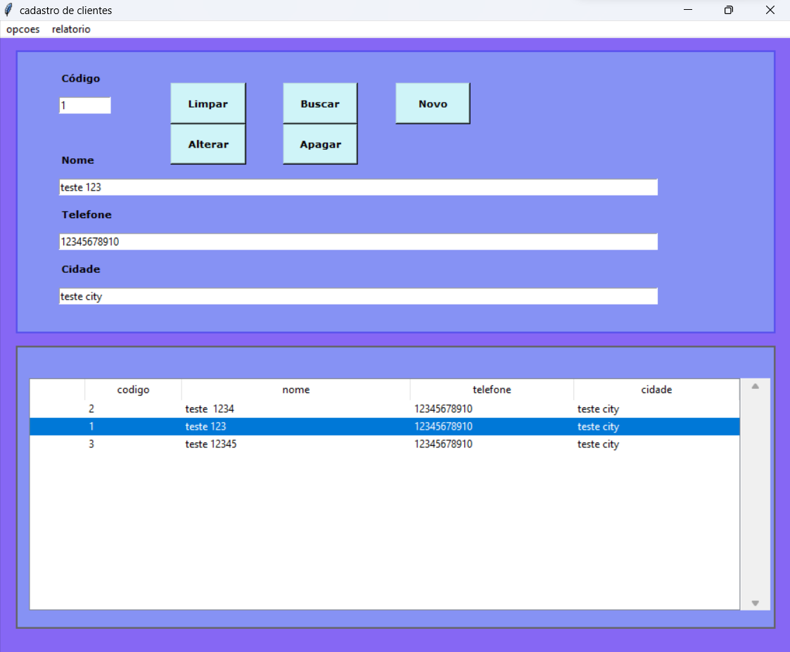
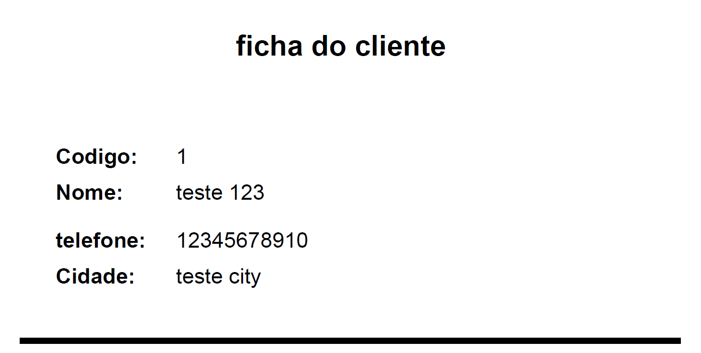

# Projeto com Tkinter
 - Tela inicial da aplicação

##
 - Relatóirio gerado em pdf 

## Sumário
- [Objetivo](#objetivo)
- [Tecnologias Utilizadas](#tecnologias-utilizadas)
- [Licença](#licença)
- [Como Usar](#como-usar)

## Objetivo
O objetivo deste projeto é familiarizar-se com a biblioteca Tkinter para criação de interfaces gráficas em Python, além de adquirir conhecimento sobre o uso do SQLite para persistência de dados. Este projeto também proporcionou a oportunidade de aprendizado e prática em design de interfaces e interação com o usuário.

## Tecnologias Utilizadas

- [Python](https://www.python.org/)
- [Tkinter](https://docs.python.org/3/library/tkinter.html)
- [SQLite](https://www.sqlite.org/index.html)
- [VS Code](https://code.visualstudio.com/)
- [Git](https://git-scm.com/)

## Como Usar

[Inserir instruções de uso aqui]

1. Clone este repositório.
2. Instale as dependências com `pip install -r requirements.txt`.
3. Execute o programa com `python main.py`.

 
## Licença

Este projeto está licenciado sob a [Licença MIT](LICENSE)

## Feito por:
- Alysson Rafael